<div align="center">

<a href="https://yashasvidev.netlify.app/"></a>
<a href="https://www.linkedin.com/in/yashasvi-rathore-412861190/"></a>
<a href="https://codeforces.com/profile/yashasvi_xvi"></a>
<a href="https://github.com/yashasvi16"></a>

</div>

---

## 🧭 About

<table>
<tr>
<td width="56%" valign="top">

```go
package main

type Engineer struct {
    Name  string
    Stack []string
    Likes string
}

func (e Engineer) Ship(ctx context.Context) error {
    // the interesting part is never the handler.
    // it's what happens when two of them run at once.
    return e.KeepStateCorrect(ctx)
}

var me = Engineer{
    Name:  "Yashasvi Singh Rathore",
    Stack: []string{"Go", "PostgreSQL", "Redis", "Docker"},
    Likes: "concurrency, caches, and things that fail loudly",
}
```

</td>
<td width="44%" valign="top">

<table>
<tr><td>⚡</td><td><b>Focus</b></td><td>Concurrency · caching · real-time</td></tr>
<tr><td>🔨</td><td><b>Daily</b></td><td>Go · PostgreSQL · Redis · Docker</td></tr>
<tr><td>🚧</td><td><b>Building</b></td><td><code>mini-sidekiq</code>, a job queue</td></tr>
<tr><td>🎮</td><td><b>Came from</b></td><td>Unity multiplayer game dev</td></tr>
<tr><td>🏅</td><td><b>Codeforces</b></td><td>Specialist · max 1408</td></tr>
<tr><td>📍</td><td><b>Based in</b></td><td>Prayagraj, India</td></tr>
</table>

<div align="center">

</div>

</td>
</tr>
</table>

---

## 🚀 Backend work

<table>
<tr>
<td width="50%" valign="top">

### [GameVault](https://github.com/yashasvi16/gamevault)

<a href="https://github.com/yashasvi16/gamevault/stargazers"></a>


Competitive gaming stats API. JWT (JSON Web Token) auth, transactional match recording, Redis cache-aside leaderboards pushed live over WebSocket, and graceful degradation when the cache is down. One-command Docker setup.


</td>
<td width="50%" valign="top">

### [Jetstrike Arena — Server](https://github.com/yashasvi16/Jetstrike-Arena-Golang)

<a href="https://github.com/yashasvi16/Jetstrike-Arena-Golang/stargazers"></a>


Authoritative game server for a 2D multiplayer shooter: matchmaking, room state, and authoritative client sync. <!-- TODO: name the transport once you confirm it, and fix the badge below if it isn't WebSocket. -->


</td>
</tr>
</table>

> **🚧 Building now — `mini-sidekiq`** &nbsp;·&nbsp; a Redis-backed background job queue in Go: enqueue, worker pool, retries with exponential backoff, dead-letter handling.
> <!-- TODO: rewrite to match what you actually shipped, then promote it into the grid above. -->

---

## 🎮 Also built

<table>
<tr>
<td width="55%" valign="top">

**Real-time multiplayer, Unity**

- [Jetstrike Arena](https://github.com/yashasvi16/Jetstrike-Arena) — 2D shooter client on Photon Fusion 2
- [Egg Bounce](https://github.com/yashasvi16/Egg-Bounce-Multiplayer) — multiplayer party game on Netcode for GameObjects


</td>
<td width="45%" valign="top">

**Computer vision, Python**

- [Crowd density estimation](https://github.com/yashasvi16/Crowd-Density-Estimation-and-Crowd-Behavior-Analysis) — M-CNN (multi-column convolutional neural network) and C3D (3D convolutional network)
- [Abandoned object detection](https://github.com/yashasvi16/Real-Time-Surveillance-abandoned-object-detection-) — real-time surveillance with OpenCV


</td>
</tr>
</table>

---

## 🧰 Stack

<table>
<tr>
<td align="right"><b>Languages</b></td>
<td>


</td>
</tr>
<tr>
<td align="right"><b>Data</b></td>
<td>


</td>
</tr>
<tr>
<td align="right"><b>Infra &amp; tools</b></td>
<td>


</td>
</tr>
<tr>
<td align="right"><b>Game dev</b></td>
<td>


</td>
</tr>
</table>

<!-- TODO: add a GitHub Actions badge to the Infra row once GameVault has a CI (continuous integration) workflow. -->

---

## 🐍 Contribution snake

<div align="center">

<picture>
  <source media="(prefers-color-scheme: dark)" srcset="https://raw.githubusercontent.com/yashasvi16/yashasvi16/output/snake-dark.svg" />
  
</picture>

</div>

<!-- 404s until .github/workflows/snake.yml runs once. Push it, then trigger it from the Actions tab. -->

<!-- ─────────────────────────────────────────────────────────────
     OPTIONAL: stats cards from community services on Vercel.
     Uncomment only if these load for you in a browser first.
     They were removed because they were rendering as broken images.

<div align="center">


</div>
     ───────────────────────────────────────────────────────────── -->

---

<div align="center">

### 💬 Reach me

<a href="https://www.linkedin.com/in/yashasvi-rathore-412861190/"></a>
<a href="https://yashasvidev.netlify.app/"></a>
<!-- TODO: add a mail badge once you pick a public address:
<a href="mailto:you@example.com"></a> -->

<br><br>

<sub><i>Thanks for scrolling all the way down.</i></sub>

</div>
